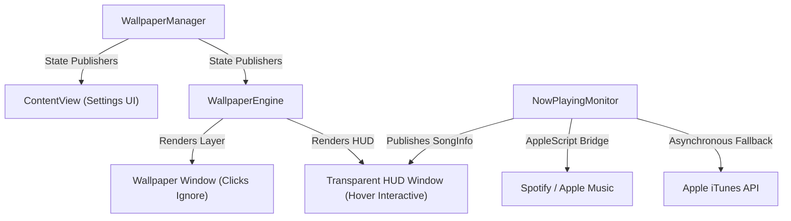

# 🎬 LiveWall for macOS
> Turn your desktop into a beautiful, living canvas with interactive, transparent music HUDs.

<p align="center">
  
  
  
  
  
</p>

---

## ✨ Features

- **Living Live Wallpapers:** Render high-definition video, fluid graphics, and beautiful images directly onto your desktop workspace underneath system icons.
- **Interactive Now Playing HUD:** A gorgeous, transparent Apple-style overlay hosting:
  - **Dynamic `AnyLayout` Morphing:** Smoothly morphs from a compact horizontal `HStack` (idle) to a centered vertical `VStack` on mouse hover with physics-driven spring mechanics.
  - **Prisline Anti-Aliased Album Art:** Uses highest-end Bicubic/Bilinear downsampling to render crystal-clear, Retina-perfect squircles at any scale.
  - **Dual-Source Music Integration:** Pulls from **Spotify** and **Apple Music** in real-time, falling back to Apple's public iTunes Search API asynchronously with 0ms in-memory caching for streamed catalog tracks.
  - **Continuous Progress Tracker:** Uses a custom low-pass linear interpolation filter to eliminate AppleScript process latency and glide progress bars with pixel-smooth fluidity.
  - **Physics VU Spectrum Visualizer:** Real-time simulations driving spring momentum-based audio waves that react organically.
- **Unified Control Panel:** A clean, sidebar-driven SwiftUI settings manager with per-wallpaper "Show Now Playing" toggles, global video volume slider, auto-cycle schedulers, "Smart Pause on Low Power Mode" options, and more.
- **True Multi-Display Coordination:** Deploys independent, hardware-accelerated rendering instances recursively across all connected monitors, dynamically scaling and adjusting as displays are plugged/unplugged.
- **Low Power Smart Pause:** Dynamically halts video loop crossfading and player layers when macOS enters Low Power Mode to conserve maximum battery life.
- **Premium Drag-and-Drop Installer:** Package-ready with custom DMG generation, custom branded disk volume icons compiled from our gorgeous custom glassmorphism AppIcon, and instant shortcut installations.

---

## 🛠️ Architecture



---

## 🏗️ Getting Started

### Prerequisites
- Any Mac running **macOS 14.0 (Sonoma)** or newer.
- **Xcode Command Line Tools** installed (`xcode-select --install`).

### Installation (Standard DMG)
To create and open your premium, branded drag-and-drop installer disk image:
```bash
./installer/create_installer.sh
```
A window will mount immediately on your screen. Simply **drag LiveWall into your Applications folder**!

### 🚀 First Run & After-Installation Guide
To ensure a smooth setup on your or your friend's Mac, follow these quick steps:

1. **Move to Applications:** Always drag the `LiveWall` icon out of the DMG and into your `/Applications` folder first. (Running the app directly inside the DMG triggers macOS **App Translocation** sandboxing, which blocks video rendering).
2. **Launch & Locate:** Double-click `LiveWall` inside `/Applications` to start it.
   - *Note on MacBook Notch:* LiveWall runs as a background assistant with **no Dock icon** to keep your workspace clean. It places a tiny **play-in-screen** (`play.display`) icon in your **System Menu Bar (near the clock)**.
   - *If the icon is missing:* On Macs with a hardware screen notch (like the MacBook Air M2/M3), macOS will automatically hide the LiveWall icon if your menu bar is crowded. Simply close another menu bar app or use a utility like *Hidden Bar* to reveal it!
3. **Grant Automation Permissions:** When prompted, click **"OK"** to allow LiveWall to communicate with Spotify/Apple Music. This is required to capture and glide Now Playing song titles in real-time.

### ⚠️ Troubleshooting: "App is damaged and can't be opened"
Because LiveWall is a custom ad-hoc compiled app, downloading it on another Mac triggers macOS **Gatekeeper / Quarantine protections**, showing a scary "app is damaged" warning. 

To fix this instantly on your friend's Mac, simply open their Terminal and run this command:
```bash
xattr -cr /Applications/LiveWall.app
```
*This instantly clears the quarantine flag, allowing the app to launch flawlessly with a double-click!*

### Manual Compilation
If you prefer compiling directly in the workspace:
```bash
./build.sh
open LiveWall.app
```

---

## ⚙️ Configuration & Project Settings
All project sources are organized recursively inside the `Sources/` directory:
- [main.swift](file:///Users/ayushjain/Projects%20&%20shi/Personal/Live%20Wall%20for%20Macos/main/Sources/main.swift): Application entry point and AppKit lifecycle bootstrapping.
- [WallpaperEngine.swift](file:///Users/ayushjain/Projects%20&%20shi/Personal/Live%20Wall%20for%20Macos/main/Sources/Core/WallpaperEngine.swift): Core AppKit window layer coordination and GPU-centric `AVPlayerLayer` crossfades.
- [WallpaperManager.swift](file:///Users/ayushjain/Projects%20&%20shi/Personal/Live%20Wall%20for%20Macos/main/Sources/Models/WallpaperManager.swift): Local wallpaper database, cycle schedulers, and user preferences manager.
- [SystemMonitor.swift](file:///Users/ayushjain/Projects%20&%20shi/Personal/Live%20Wall%20for%20Macos/main/Sources/Monitors/SystemMonitor.swift): Detects macOS fullscreen windows, battery transitions, and hardware states.
- [ContentView.swift](file:///Users/ayushjain/Projects%20&%20shi/Personal/Live%20Wall%20for%20Macos/main/Sources/Views/ContentView.swift): The main SwiftUI settings sidebar and gallery interface.

---

## 📜 License
Developed with ❤️ by Ayush Jain. Distributed under the MIT License.
